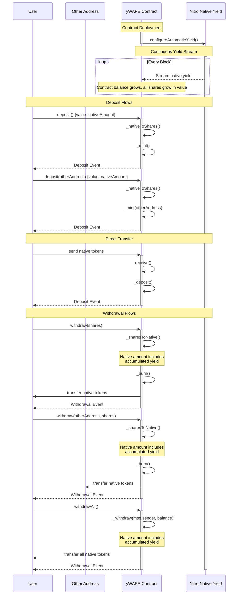

# yWAPE (Yield-bearing Wrapped ApeCoin)

## Overview

yWAPE is a yield-bearing ERC20 wrapper for native tokens, specifically designed for APE. It allows users to deposit native tokens and receive shares that automatically accrue yield through the ApeChain's Nitro Native Yield module. The contract implements the WETH9 interface while adding yield-bearing capabilities.

## Key Features

- **Automatic Yield Distribution**: Integrates with the Nitro Native Yield module to automatically distribute yield to all token holders proportional to their share ownership
- **Share-Based System**: Uses a share-based accounting system where tokens represent a proportional claim on the total underlying balance
- **Standard ERC20 Interface**: Fully compatible with ERC20 standard, enabling integration with existing DeFi protocols
- **Flexible Deposits**: Supports direct deposits through native token transfers and deposits on behalf of other addresses
- **Multiple Withdrawal Options**: Allows partial and complete withdrawals with options to specify recipient addresses

## Technical Design

### Share Calculation

The contract uses a share-based system to track ownership of the underlying native tokens. Two key conversion functions manage this:

1. `_nativeToShares`: Calculates shares to mint for a given native token deposit
   - For the first deposit, shares = native amount
   - Subsequently, shares = (native_amount * total_supply) / (total_balance - native_amount)

2. `_sharesToNative`: Calculates native tokens to return for a given share amount
   - Native amount = (shares * total_balance) / total_supply

This system ensures:

- Fair distribution of yield across all token holders
- Protection against share price manipulation
- Accurate accounting of deposits and withdrawals

### Deposit Methods

The contract provides three ways to deposit:

1. Direct transfer to contract address (using `receive()`)
2. Standard `deposit()` function
3. Delegated `deposit(address to)` function for third-party deposits

### Withdrawal Methods

Users can withdraw their tokens through:

1. `withdraw(uint256 wad)`: Partial withdrawal to caller
2. `withdraw(address dst, uint256 wad)`: Partial withdrawal to specified address
3. `withdrawAll()`: Complete withdrawal of caller's balance

### Safety Features

- Revert on zero deposits (`ZeroDeposit` error)
- Revert on withdrawals to zero address (`ZeroAddress` error)
- Revert on failed withdrawals (`WithdrawalFailed` error)
- Protected share calculations to handle edge cases (empty contract)

## Usage Examples

### Basic Deposit

```solidity
// Deposit by sending native tokens directly
address(wape).call{value: 1 ether}("");

// Or use the deposit function
wape.deposit{value: 1 ether}();
```

### Deposit for Another Address

```solidity
wape.deposit{value: 1 ether}(recipientAddress);
```

### Withdrawal

```solidity
// Withdraw specific amount
wape.withdraw(shareAmount);

// Withdraw all balance
wape.withdrawAll();

// Withdraw to different address
wape.withdraw(recipientAddress, shareAmount);
```

## Security Considerations

- The contract inherits from audited implementations (Solady's ERC20)
- Share calculations are designed to prevent rounding exploits
- Share-modifying functions include implicit reentrancy protections
- Native token handling follows established patterns from WETH9

## Interaction Diagram



## License

This contract is licensed under GPL-3.0. See the [LICENSE](LICENSE) for more details.
